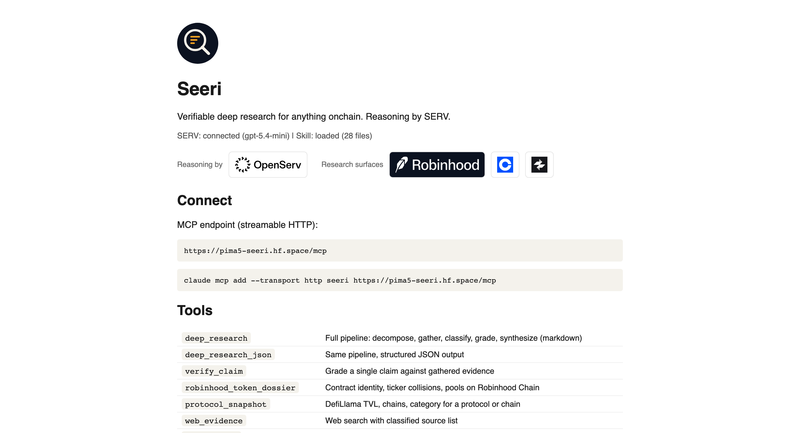

<p align="center">
  
</p>

<p align="center">
  <a href="https://pima5-seeri.hf.space"></a>
  <a href="https://github.com/fozagtx/seeri/stargazers"></a>
  <a href="./LICENSE"></a>
  <a href="https://www.openserv.ai/hackathon"></a>
</p>

# Seeri

Seeri is a research agent you plug into Claude (or any MCP client) that turns a messy onchain question into evidence you can defend. Instead of "search and summarize," it decomposes the question, pulls primary sources (chain RPC, pools, TVL, docs), grades every claim with a confidence level, and tells you what would change its mind. Every reasoning step runs on SERV. Built for people about to act on money: traders, analysts, agent builders, and writers who need the research done right, today.

## Built with

Seeri is free and MIT-licensed. These are the systems it reasons with and researches.

<table align="center">
  <tbody>
    <tr>
      <td colspan="12" width="850" align="center"><a href="https://www.openserv.ai/"></a><br /><sub>Reasoning by SERV</sub></td>
    </tr>
    <tr>
      <td colspan="4" width="283" align="center" bgcolor="#0B1220"><a href="https://robinhood.com/"></a></td>
      <td colspan="4" width="283" align="center"><a href="https://www.coinbase.com/developer-platform"> <b>Coinbase AgentKit</b></a></td>
      <td colspan="4" width="283" align="center"><a href="https://www.ixs.finance/"> <b>IXS Finance</b></a></td>
    </tr>
    <tr>
      <td colspan="4" width="283" align="center"><a href="https://huggingface.co/spaces/pima5/seeri"> <b>Hugging Face Spaces</b></a></td>
      <td colspan="4" width="283" align="center"><a href="https://modelcontextprotocol.io/"><b>Model Context Protocol</b></a></td>
      <td colspan="4" width="283" align="center"><a href="https://www.geckoterminal.com/"><b>GeckoTerminal</b></a> · <a href="https://defillama.com/"><b>DefiLlama</b></a></td>
    </tr>
  </tbody>
</table>

<p align="center"><sub>Logos are the official assets of their owners; sources in <a href="./mcp/assets/partners/SOURCES.md">SOURCES.md</a>. Seeri is not affiliated with or endorsed by them.</sub></p>

## Why Seeri

**Verifiable, not vibes.** Every claim is tied to a source category (chain state, price feed, market data, primary docs, regulatory, news, social) and an interest label (independent, interested, project-reported). High confidence requires a primary source plus independent corroboration across two categories. Nothing less.

**Contract identity first.** Tickers collide on purpose. Ask Seeri for `HOOD` on Robinhood Chain and it resolves six distinct tokens through the mainnet RPC (HOOD, HOODS, HOODCATS, HOODRAT, HOODIE, pHOOD3x), shows the liquidity behind each, and refuses to attribute a price to "HOOD" until the contract is confirmed against the issuer registry. That is the check an agent needs before it trades.

**The method is a skill you can read.** Seeri's research method lives in `skill/` as plain Markdown. The MCP server loads it at runtime and hands it to SERV as the system context on every call. Change the skill, change the agent. Call `seeri_skill("SKILL.md")` from Claude and read exactly how it thinks.

**Reasoning by SERV.** Decompose, classify, grade, synthesize: 25 small structured calls per report, each with a strict JSON contract, each recorded in an audit footer with token counts. In the demo run: 33 seconds, 0 failed calls, on `gpt-5.4-mini`.

**Read-only by design.** Seeri holds no wallet and signs nothing. It is the research layer that sits above trading tools like Robinhood MCP and Coinbase AgentKit.

## Installation

Seeri is hosted. Nothing to install for the MCP:

**Claude.ai / Claude Desktop:** Settings, Connectors, Add custom connector, paste:

```
https://pima5-seeri.hf.space/mcp
```

**Claude Code:**

```bash
claude mcp add --transport http seeri https://pima5-seeri.hf.space/mcp
```

**Cursor / any MCP client** (streamable HTTP):

```json
{ "mcpServers": { "seeri": { "url": "https://pima5-seeri.hf.space/mcp" } } }
```

Then ask:

```
Is the HOOD Stock Token on Robinhood Chain trading at a premium to the underlying, and how deep is its liquidity?
```

## Setup with AI

You need two things: an AI coding agent and this repo.

**1. Get an agent.** Claude Code is recommended; Cursor, OpenCode, and others work.
**2. Open the agent in a clone of this repo and paste:**

```
Install the Seeri research skill with ./install.sh -y, then connect the Seeri MCP with `claude mcp add --transport http seeri https://pima5-seeri.hf.space/mcp`. When you're done, run the HOOD dossier so I can see the ticker-collision check.
```

When the dossier table comes back with six contract addresses, you're ready. Pick a domain pack in `skill/domains/` and make it yours.

## Tools

| Tool | What it does |
| --- | --- |
| `deep_research` | Full pipeline. Thesis, key findings, evidence grid, domain checklist, sources, caveats, what would change my mind, SERV audit footer. |
| `deep_research_json` | Same report as structured JSON for downstream agents. |
| `verify_claim` | Triangulate one claim across source categories and grade it. |
| `robinhood_token_dossier` | Resolve a ticker or address on Robinhood Chain: RPC-decoded identity, pools, liquidity, 24h volume, ticker-collision warning. |
| `protocol_snapshot` | DefiLlama TVL and chain footprint for any protocol or chain. |
| `web_evidence` | Search, fetch, and classify web sources by category, interest, and freshness. |
| `seeri_skill` | Read any file of the research method. |
| `list_skill_files` | List the skill files. |

Also exposed: MCP resource `seeri://skill/{path}` and prompt `research_brief(question, decision)`.

## Domain packs

Each pack adds primary sources in trust order, a verify-first list, the traps, and the grid rows a report must include.

| Pack | Covers |
| --- | --- |
| `domains/robinhood-chain.md` | Robinhood Chain (4663), Stock Tokens, oracle vs DEX price, launches |
| `domains/agentkit-base.md` | Coinbase AgentKit, Base, agent wallets, custody and spend controls |
| `domains/ixs-rwa-vaults.md` | IXS and licensed RWA yield vaults: license, eligibility, yield source, redemption |
| `domains/memecoin-markets/` | Attention markets, launch safety, on-chain checks (13 chapters) |

## Run it yourself

```bash
export SERV_API_KEY="..."            # console.openserv.ai; without it Seeri falls back to local reasoning
cd mcp && ./sync_skill.sh            # vendor skill/ into the server
pip install -r requirements.txt
uvicorn server:app --port 7860       # MCP at http://localhost:7860/mcp
```

Or install just the skill into your agent: `./install.sh -y` (copies to `~/.agents/skills/seeri`). Validate the repo with `bash tests/validate_structure.sh`.

## How a report is built

1. **Decompose.** SERV breaks the question into 5-8 sub-questions, each targeting one evidence type, including a counterargument.
2. **Gather.** Primary sources first: Robinhood Chain RPC (`eth_call` for identity and supply), GeckoTerminal pools, DefiLlama, then the open web.
3. **Classify.** SERV labels each source by category, interest, freshness, and any domain trap it could trigger.
4. **Grade.** SERV grades each sub-question against the evidence using the skill's confidence rules.
5. **Synthesize.** Thesis, domain checklist, caveats, what would change my mind, next checks, audit footer.

SERV output is never cited as a source. It organizes evidence; it does not create it.

## Repository

```text
skill/            The research method (SKILL.md, workflow, source map, evidence grid, reasoning-serv, domains/)
mcp/              MCP server: server.py, Dockerfile, seeri/ (pipeline, serv, sources, prompts, skill_loader), vendored skill/
agents/ commands/ rules/   Agent configs, slash commands, evidence-integrity guardrails
tests/            validate_structure.sh
SUBMISSION.md     Hackathon notes, demo prompts, revenue path
```

Educational research output. Not investment, legal, or tax advice.

## License

MIT
